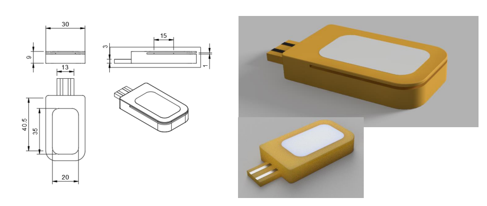

+++ 
draft = false
date = 2025-11-26T12:46:55+01:00
title = "Basketball Local Indoor Positioning System: Big Bang Fair Runner-up 2021"
description = ""
slug = "big-bang-competition"
authors = []
tags = []
categories = []
externalLink = ""
series = []
+++

**Skills: Arduino, Java, Android Studio, Fusion360, Product Design**



In my last year of high school over a couple of months in 2021 I designed a system for tracking a player's basketball shooting percentages at different positions on the court. The inspiration for this came from my interest in basketball, desire to learn more practical engineering before my university course and inspiration from popular engineering creators. Additionally, I entered it into the 2021 Big Bang competition and won a scholarship to attend the 61st London International Youth Science Forum. This project was a lot of fun, and I learnt a lot about each stage of the project lifecycle while working with a very small budget. Four years of experience and an engineering degree later, I see how every part of the process could be improved. We'll see if I revisit it...

<!-- 
I learnt a lot about managing a project end-to-end. 

From my system, 

My solution was building my own shot tracker, which I did in a month during my last year of highschool.[^a] I entered it into the 2021 Big Bang competition and won a scholarship to attend the 61st London International Youth Science Forum. It was a fun project, although looking back on it after doing a whole engineering degree I see how I could have done literally everything better. Slightly tempted to redo it now, but we'll see if I ever make time for that.

-->

<!--
4 years ago I was into basketball, and I wanted to find a way to improve. I didn't know of any local teams, so I would practice dribbling by watching In The Lab videos.

Wanted to try hardware and to create something useful. Inspired by YouTubers trending at the time.
Focused on the engineering not stuff around it. Did some interesting engineering stuff but not all of it was useful.

Summary of the project and the competition. Skills I learnt/technologies I used and how it went overall.

-->

# Project output



The main output was a tool that could track shooting percentages at different positions on the basketball court. The idea is that this could be used to track progress over time and highlight strengths/weaknesses.

The system worked by having a small module inserted under the sweatband of a player. Position would be determined using bluetooth signal strength from different beacons placed around the court. The module continuously tracks the position of the player on the court, and when a shot is made or missed, it can be logged by tapping or double tapping on the wrist.

Because bluetooth signal strength doesn't perfectly decrease with distance from a beacon with the inverse square law, a K-Nearest-Neighbour machine learning algorithm was used to detect player position from 10 different positions on the court. The system needed around 5 minutes of training data to function at a high accuracy.

### Key takeaways

The main thing I've realised looking at this project in hindsight is that I focused too much on making an interesting engineering project, which was good for technical development but not useful for developing something in the real world. Engineering as a field is about much more than making something cool technically.

If I had to do this project again, I would find a user need and validate it with the most informative, least effort solution I could. E.g. manually counting shots for myself or a basketball team and finding whether that data had a use. By defining functional and non-functional requirements more clearly, I would have had more direction during research and development of my prototype.

# Project phases

## 1. Problem definition and early research

- Project scope: Tracking a basketball player's shooting accuracy from different positions on the court to track player performance

- Functional requirements: 
    - Track player position on the court in real time.
    - Label whether a shot was made or missed (either manually or automatically)
    - Associate each shot with the correct court position
    - The system should not interfere with the player's movement

- Non-functional requirements:
    - Low cost: < £200 budget
    - Portable and easy to set up on any court, including outdoors
    - (If wearable module used) Lightweight and comfortable wearable module

- Survey of existing indoor positining technologies:
    - Time-of-Flight sensors: accurate but expensive. Less reliable outdoors and depth range up to 5m.
    - Computer vision: Can have high accuracy but setting up the camera is more complex for different court types
    - UWB: High accuracy but too expensive
    - Bluetooth/Wifi Signal Strength: Cheap and widely available. Sensors for robust design widely available but signal is noisy.
    - Ultrasound: Too low accuracy
    - Existing commercial technologies: Looked through ShotTracker patents to understand imaging technology

Outcome:
- Decided to create a BLE-based positioning system with a manual shot logging system, which best matched the design constraints and resources available to me.

## 2. Hardware exploration and selection

Coming soon...

## 3. System design and algorithm development

Coming soon...

## 4. Testing and validation

Coming soon...

## Design images

<!-- 
---
#### Technical focuses

Input modality

Positioning technology

## **2. Hardware Exploration & Selection**

Once the approach was decided, I explored hardware options and built the first prototypes.

### **Activities**

* **Microcontroller research (Arduino Nano, ESP32, etc.):**
  Ultimately selected a microcontroller with BLE capability due to ease of use and available documentation.
* **Selecting BLE beacons:**
  Tested multiple BLE modules, comparing:

  * signal stability
  * power consumption
  * range across a full-size basketball court
* **Investigating input methods to log shots:**

  * Push buttons (inconsistent + risk of accidental activation)
  * Capacitive touch sensors
  * IMU-based detection of wrist flick (too noisy + gesture-specific)
    Settled on **tap / double-tap via capacitive sensing**, which was simple and reliable.
* **Mechanical considerations:**

  * Designed a form factor small enough to fit under a sweatband.
  * Ensured robustness against sweat and impact.

### **Outcome**

A prototype hardware stack: BLE receiver on the wrist module + BLE beacons placed around the court + simple haptic-style input for shot logging.

---

## **3. System Design & Algorithm Development**

This phase focused on structuring the end-to-end pipeline from data collection to position prediction.

### **Activities**

* **Architecting the system:**

  * BLE beacons broadcast signal strength.
  * Wearable module collects RSSI values.
  * Module logs taps for made/missed shots.
  * Laptop/desktop performs training + classification.
* **Data acquisition for positioning:**
  Collected RSSI values at 10 carefully chosen points on the court (3-point line corners, wings, top of key, mid-range positions, etc.).
* **Choosing a positioning algorithm:**
  Since RSSI doesn't follow a clean mathematical decay, simple analytical models failed.
  Switched to **K-Nearest Neighbour (KNN)** because:

  * It works well with small datasets.
  * It handles noisy spatial data.
  * It’s simple to implement and visualize.
* **Model training and evaluation:**

  * ~5 minutes of labeled data per court allowed KNN to achieve surprisingly good accuracy.
  * Cross-court interference and multipath effects required smoothing and filtering.
* **Shot event processing:**
  Implemented:

  * Single tap = shot missed
  * Double tap = shot made
  * Timestamp matching to the nearest predicted position.

### **Outcome**

A functional position-estimation pipeline and a working prototype linking positions to shot outcomes.

---

## **5. Testing & Validation**

The final phase involved collecting real data to see if the system worked in practice.

### **Activities**

* **Indoor court testing with friends:**

  * Set up beacons around the court.
  * Wore the device while shooting from different positions.
  * Logged makes/misses through taps.
* **Measuring accuracy:**

  * Positioning accuracy assessed by comparing predicted vs. true positions.
  * Shot logging accuracy validated by replaying taps.
* **Collecting UX feedback:**

  * Comfort of the wristband.
  * Ease of remembering tap patterns.
  * Placement and size of beacons.
* **Performance summary:**

  * Position prediction accuracy surprisingly high after training.
  * Shot logging reliable.
  * System somewhat sensitive to environmental changes (different courts, different beacon layouts).

### **Outcome**

A fully functional proof-of-concept capable of tracking shooting percentages across court regions, validated through real shooting sessions.

-->

<!-- 
## **1. Problem Definition & Early Research**

This phase focused on understanding what the system should achieve and exploring feasible technical approaches.

### **Activities**

* **Clarifying the intended outcome:**
  I wanted to track a basketball player’s shooting accuracy from different points on the court to better understand strengths and weaknesses.
* **Identifying functional requirements:**

  * Track player position on the court in real time.
  * Allow the player to log a made/missed shot.
  * Associate each shot with the correct court position.
  * Operate without interfering with the player's movement.
* **Identifying non-functional requirements:**

  * Low cost — <£X budget.
  * Portable and easy to set up on any court.
  * Lightweight and comfortable wearable module.
* **Surveying existing indoor positioning technologies:**

  * **Time-of-Flight (ToF)** sensors — accurate but expensive and required more hardware than feasible.
  * **Computer vision** — too compute-heavy and needed cameras/line of sight.
  * **UWB** — high accuracy but unaffordable on a student budget.
  * **Bluetooth RSSI** — cheap, available, but noisy. Ultimately chosen as the most practical option.
* **Benchmarking existing commercial solutions:**
  Looked into products like ShotTracker and Noah, but these were either proprietary or used infrastructure I couldn’t replicate on a small budget.

### **Outcome**

A clear decision to build a **BLE-based positioning + tap-to-log wearable system**, even with its limitations, because it was the most achievable for a high-school-level project.

- Research into defining the project
    - Defining desired functional requirements (tracking positions, shots)
    - Research into existing positiong technologies (ToF, Imaging, )
- Research into which hardware to use (Arduino)/components to purchase like the BLE modules (note that looking through documentation was annoying)
Into possible input modalities and sensors, capacative buttons, pressure sensor 
- Design and iteration
    - wanted to originally autonomaously control shots but the shooting motion was quite specific
- Testing
    - Tested it with my friends at an indoor court

-->

<!--Raw materials from the project that I have left-->

<!--
# Skills developed
- understanding a market and state of the art (reading patents and user cases of existing products)
- entrepreneurial skills (although I should have worked harder on product-market fit)
- Engineering skills
- Exploratory research and data analysis ()
- Project management (although at the time it was more time management + spend as much time as I could on the project)
- Marketing
-->

<!--

# Specific project improvements
- Design feedback cycle started earlier
- Decide where to focus efforts on
- Creating functional requirements and non-functional requirements

# Wide-ranging lessons

- Old work can build useful skills. I stopped putting this project on my CV after about two years, so I hadn't thought of it in detail for a long time. However, I learnt a lot by doing this project and had done some useful work.
- The importance of mentorship/feedback in new domains. 
- So much harder to collate information and learn from it pre-AI. Going from the internet to AI is what books to the internet probably felt like.
- Engineering is about so much more than making something cool. Finding use and a market for your product is a whole other industry. Keeping these things in mind while making a product will make you a better engineer.
- Doing smart things without knowing the name for them. E.g. collecting a reference dataset for jump height
- Understanding the role of technology. I didn't have access to a coach. Shooting coach and maybe just shooting a lot. could have been more useful. Just counting manually could have been useful to find the useufulness of the idea. To see whether product market fit is useful.
- Coming back to this after, learnt a couple lessons. Iteration is important (as well as funding).
- Document your work. That's why research exists and publishing papers. I did way more than  could remember recovering this. (Also I lost the original files)

-->

<!-- 
# Project Overview

- Hardware
    - A controller arduino module, to be worn under sweatband
    - 3 messenger BLE modules to calculate signal stength from
    - Phone for setting system up

- Software
    - Java and C on microcontrollers

    [^a]: I have a memory of staying up late to finish writing my report and not sleeping very well before one of my Chemistry A-Level exams. I got an A* any, so I guess it worked out.
-->